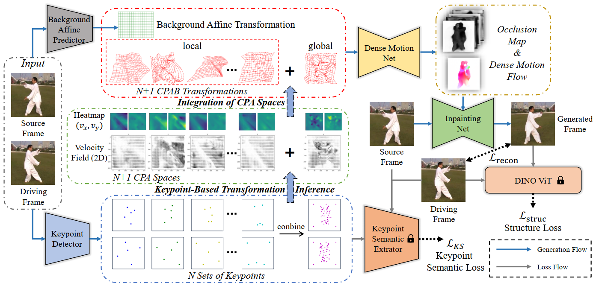
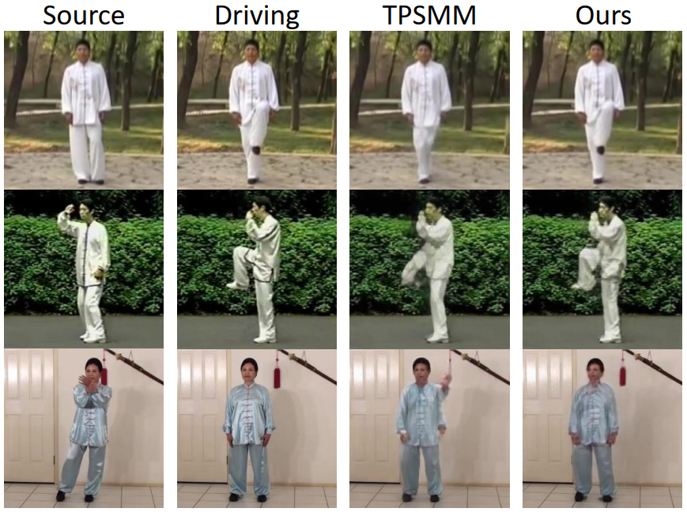
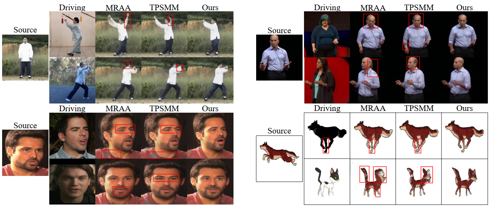

# Continuous Piecewise-Affine Based Motion Model for Image Animation (AAAI 2024)

###  [Paper](https://doi.org/10.48550/arXiv.2401.09146 )
<!-- <br> -->
[Hexiang Wang](https://github.com/DevilPG), 
[Fengqi Liu](liufengqi@sjtu.edu.cn), 
[Qianyu Zhou](https://qianyuzqy.github.io/),
[Ran Yi](https://yiranran.github.io/), 
[Xin Tan](https://tanxincs.github.io/), 
 and [Lizhuang Ma](https://dmcv.sjtu.edu.cn/) 
<!-- <br> -->



## Introduction

### Abstract
>Image animation aims to bring static images to life according to driving videos and create engaging visual content that can be used for various purposes such as animation, entertainment, and education. Recent unsupervised methods utilize affine and thin-plate spline transformations based on keypoints to transfer the motion in driving frames to the source image. However, limited by the expressive power of the transformations used, these methods always produce poor results when the gap between the motion in the driving frame and the source image is large. To address this issue, we propose to model motion from the source image to the driving frame in highly-expressive diffeomorphism spaces. Firstly, we introduce Continuous Piecewise-Affine based (CPAB) transformation to model the motion and present a well-designed inference algorithm to generate CPAB transformation from control keypoints. Secondly, we propose a SAM-guided keypoint semantic loss to further constrain the keypoint extraction process and improve the semantic consistency between the corresponding keypoints on the source and driving images. Finally, we design a structure alignment loss to align the structure-related features extracted from driving and generated images, thus helping the generator generate results
that are more consistent with the driving action. Extensive experiments on four datasets demonstrate the effectiveness of our method against state-of-the-art competitors quantitatively and qualitatively. 

This work has been accepted by AAAI 2024. 


### Examples of video reconstruction and image animation




## Installation
Please run the project in ```python3``` environment.
To install the dependencies run:
```bash
pip install -r requirements.txt
```
## Configuration
Configuration files are in the `config` folder, one for each `dataset`, named as ```config/dataset_name.yaml```.

## Datasets
Follow [TPSMM](https://github.com/yoyo-nb/Thin-Plate-Spline-Motion-Model)

## Training
To train a model on specific dataset run:
```
python run.py --config config/dataset_name.yaml --log_dir dir_to_save_log_files --tag id_for_training_task
```

### Training AVD network
To train a model on specific dataset run:
```
python run.py --mode train_avd --checkpoint '{checkpoint_folder}/checkpoint.pth.tar' --config config/dataset_name.yaml
```

## Evaluation on video reconstruction
To evaluate the model on video reconstruction task run:
```
CUDA_VISIBLE_DEVICES=0 python run.py --mode reconstruction --config config/dataset_name.yaml --checkpoint '{checkpoint_folder}/checkpoint.pth.tar'
```
To compute quantitative metrics, please follow instructions from [pose-evaluation](https://github.com/AliaksandrSiarohin/pose-evaluation).

## Image animation demo
To generate a animation video with a source image and a driving video run:
```bash
python demo.py --config config/dataset_name.yaml --checkpoint {checkpoint_folder}/checkpoint.pth.tar --source_image path_to_source_img --driving_video path_to_driving_video
```

## Citation

If you find this code helpful for your research, please cite:

```
@article{wang2024cpabmm,
  title={Continuous Piecewise-Affine Based Motion Model for Image Animation},
  author={Hexiang Wang and Fengqi Liu and Qianyu Zhou and Ran Yi and Xin Tan and Lizhuang Ma},
  journal={arXiv preprint arXiv:2401.09146},
  year={2024}
}
```
